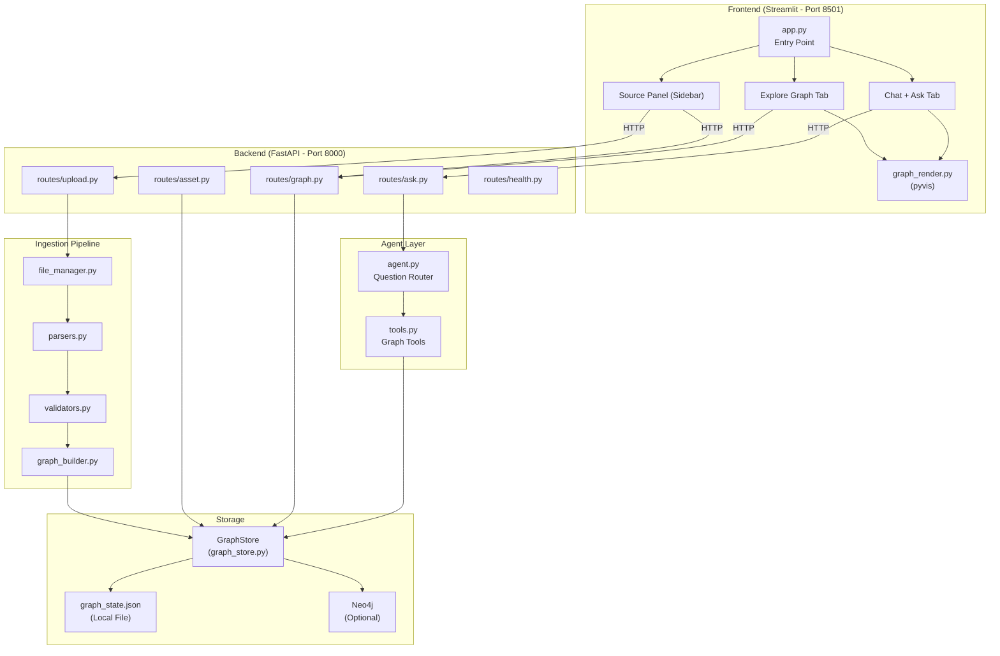
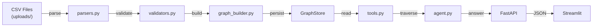
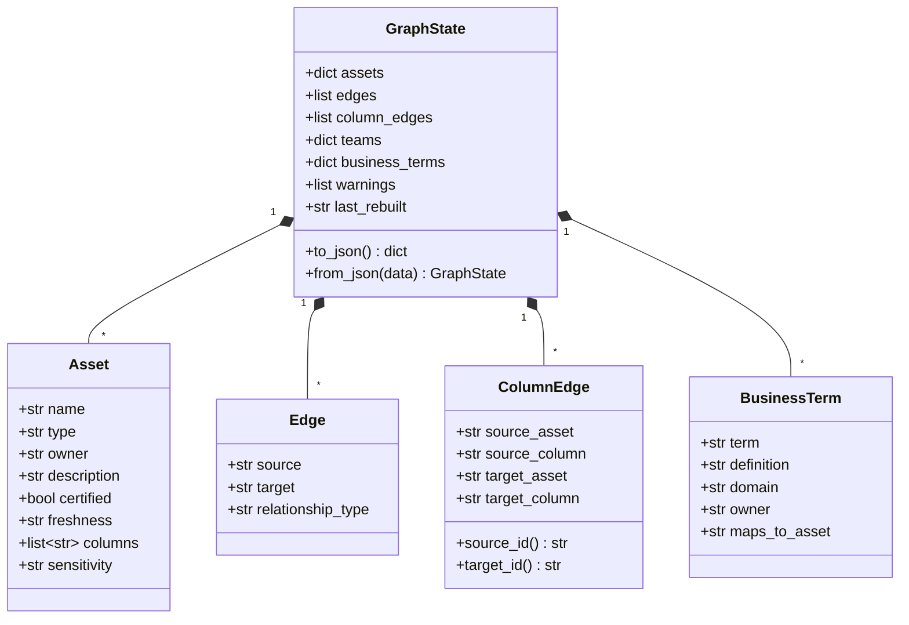
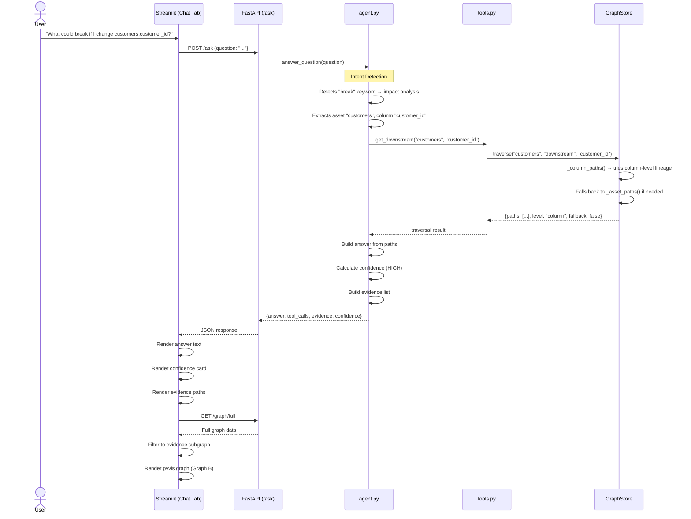
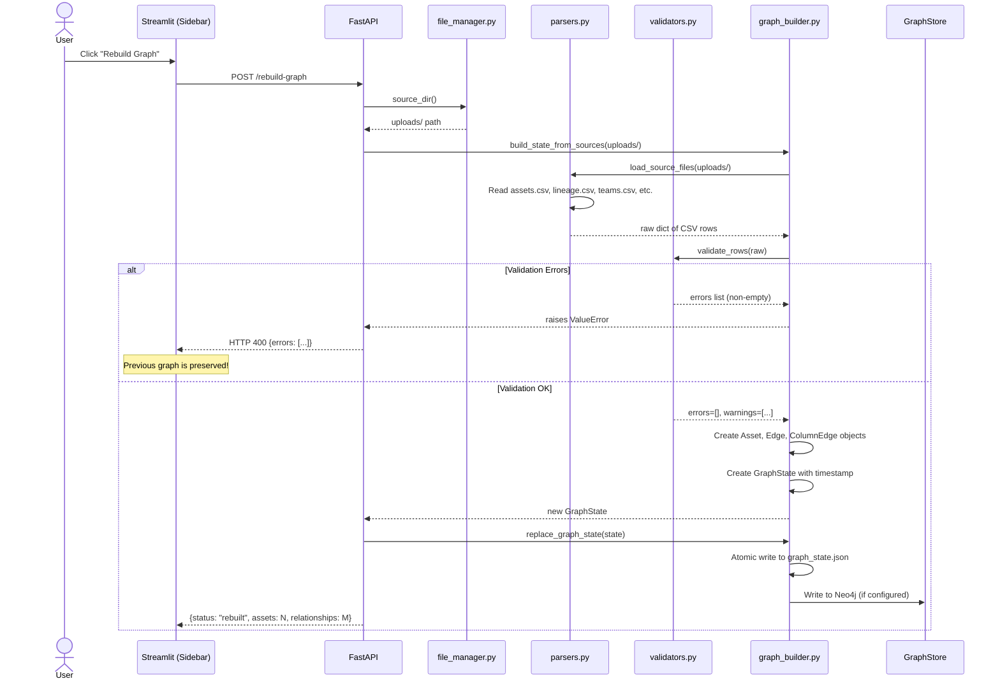
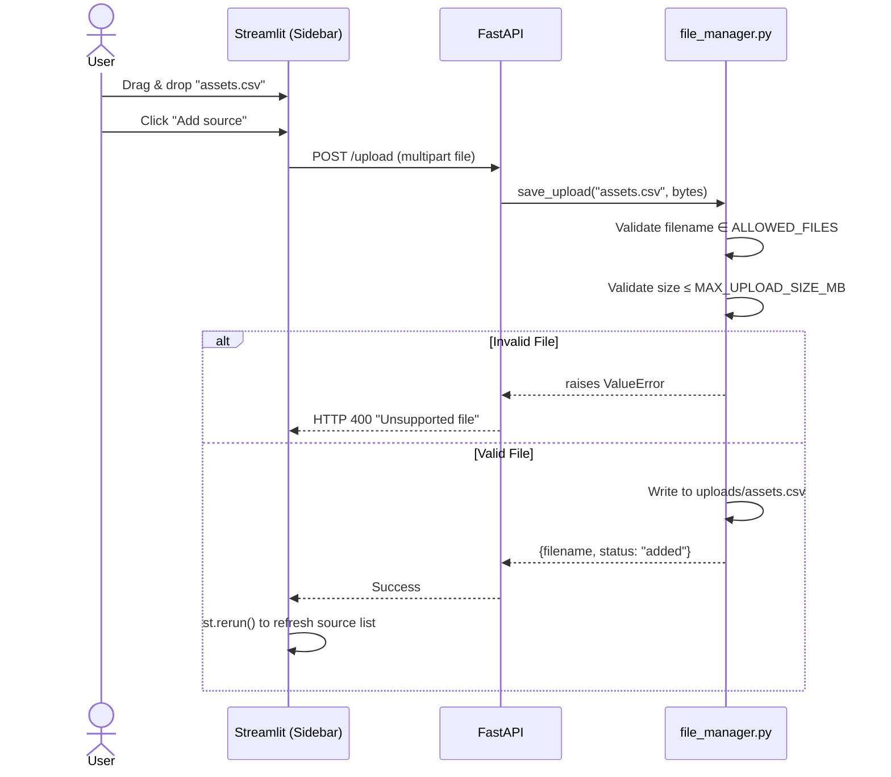
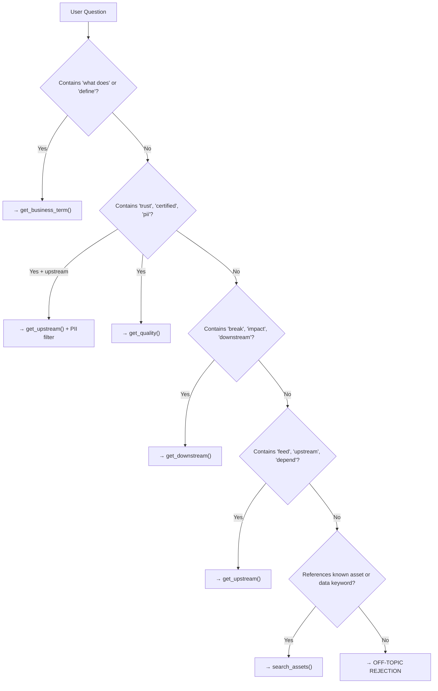

# ContextGraph — Comprehensive Project Documentation

> **An AI-powered data lineage intelligence platform that lets data teams ask natural-language questions about their data ecosystem and get grounded, evidence-backed answers with interactive graph visualizations.**

---

## Table of Contents

1. [Why ContextGraph Exists](#1-why-contextgraph-exists)
2. [What It Does — Feature Overview](#2-what-it-does--feature-overview)
3. [System Architecture](#3-system-architecture)
4. [Data Model](#4-data-model)
5. [Sequence Diagrams](#5-sequence-diagrams)
6. [Project Structure](#6-project-structure)
7. [Component Deep-Dives](#7-component-deep-dives)
8. [API Reference](#8-api-reference)
9. [Demo Data](#9-demo-data)
10. [Evaluation & Testing](#10-evaluation--testing)
11. [Configuration & Environment Variables](#11-configuration--environment-variables)
12. [Getting Started](#12-getting-started)
13. [Technology Stack](#13-technology-stack)

---

## 1. Why ContextGraph Exists

### The Problem

Modern data teams maintain hundreds of tables, dashboards, ML models, and pipelines across a data warehouse. When an engineer asks *"What could break if I change the `customer_id` column in the customers table?"*, there is no quick way to answer this without manually tracing every downstream dependency — a process that is slow, error-prone, and scales terribly.

Existing data catalogs (Atlan, DataHub, etc.) provide lineage graphs, but they don't let you *ask questions in plain English* and get *evidence-backed, confidence-scored answers*.

### The Solution

ContextGraph solves this by:

1. **Ingesting** your organization's metadata (assets, lineage, teams, business glossary) from simple CSV files.
2. **Building a traversable graph** of your data ecosystem (stored locally as JSON or in Neo4j).
3. **Running an AI agent** that parses natural language questions, executes deterministic graph traversals (not hallucinated LLM reasoning), and returns answers with:
   - The exact graph paths that form the evidence.
   - A confidence score (HIGH / MEDIUM / LOW) based on completeness of traversal.
   - An interactive visual subgraph highlighting the evidence.

### Key Differentiators

| Feature | Traditional Catalogs | ContextGraph |
|---|---|---|
| Query method | Click through a graph UI | Ask in plain English |
| Answer grounding | Visual-only | Deterministic graph traversal + confidence score |
| Evidence | None | Exact paths + interactive subgraph |
| Off-topic handling | N/A | Guardrail rejects non-data questions |
| Setup time | Days/weeks | 1 Docker command |

---

## 2. What It Does — Feature Overview

### 2.1 Natural Language Q&A (Chat + Ask Tab)

Users can ask questions like:
- *"What could break if I change `customers.customer_id`?"* → Impact analysis
- *"What tables feed the revenue dashboard?"* → Upstream lineage
- *"Can I trust `churn_features`?"* → Trust & quality check
- *"What does Revenue mean?"* → Business glossary lookup
- *"Which PII tables feed the revenue dashboard?"* → Sensitivity-aware lineage
- *"What is my name?"* → Gracefully rejected (off-topic guardrail)

Each response includes:
- A **natural-language answer** grounded in graph traversal.
- A **confidence score** (`HIGH` / `MEDIUM` / `LOW`).
- The exact **evidence paths** traversed.
- An **interactive evidence subgraph** visualization.

### 2.2 Full Graph Explorer (Explore Graph Tab)

An interactive network visualization of your entire data ecosystem with:
- **Filter by Type**: Table, Dashboard, MLModel.
- **Filter by Owner**: Data Platform, Finance Analytics, etc.
- **Filter by Certification**: Certified only checkbox.
- **Color-coded nodes**: Green (Table), Blue (Dashboard), Purple (MLModel).
- **Inspect any asset**: Click to see full metadata, upstream/downstream dependencies.

### 2.3 Source Management (Sidebar)

- **Upload CSV** files to replace or add metadata.
- **Remove** individual CSV files.
- **Rebuild Graph**: Re-ingests all CSVs and rebuilds the graph (with validation).
- **Reset to Demo Data**: Restores the bundled demo dataset.
- **Live metrics**: Shows asset count, relationship count, and last rebuild time.

---

## 3. System Architecture

### 3.1 High-Level Architecture



### 3.2 Component Interaction Overview



---

## 4. Data Model

### 4.1 Core Domain Objects



### 4.2 Relationship Types

| Relationship | Meaning | Example |
|---|---|---|
| `FEEDS` | Source provides raw data to target | `customers` → `orders` |
| `DERIVED_FROM` | Target is computed from source | `orders` → `daily_revenue` |
| `USED_BY` | Source is consumed by target dashboard/report | `daily_revenue` → `revenue_dashboard` |
| `TRAINED_ON` | ML model trains on target dataset | `customer_churn_model` → `churn_features` |

### 4.3 Sensitivity Levels

| Level | Meaning |
|---|---|
| `PUBLIC` | Open data, no restrictions |
| `INTERNAL` | Internal use only (default) |
| `CONFIDENTIAL` | Restricted access (e.g., payments) |
| `PII` | Personally Identifiable Information |

---

## 5. Sequence Diagrams

### 5.1 Asking a Question (Impact Analysis)



### 5.2 Rebuilding the Graph



### 5.3 Uploading a CSV



---

## 6. Project Structure

```
ContextGraph/
├── backend/
│   ├── __init__.py
│   ├── main.py                  # FastAPI app — mounts all routers
│   ├── config.py                # All config constants & env vars
│   ├── models.py                # Dataclasses: Asset, Edge, ColumnEdge, etc.
│   ├── agent.py                 # AI agent — routes questions to tools
│   ├── tools.py                 # Tool functions the agent calls
│   ├── bootstrap.py             # One-time setup: load demo data + build graph
│   ├── routes/
│   │   ├── __init__.py
│   │   ├── ask.py               # POST /ask
│   │   ├── asset.py             # GET /asset/{name}, GET /business-term/{term}
│   │   ├── upload.py            # POST /upload, DELETE /upload/{filename}, GET /sources
│   │   ├── graph.py             # POST /rebuild-graph, POST /reset-demo, GET /graph/*
│   │   └── health.py            # GET /health
│   ├── ingestion/
│   │   ├── __init__.py
│   │   ├── parsers.py           # CSV reading + column/bool parsing
│   │   ├── validators.py        # Schema & referential integrity validation
│   │   ├── graph_builder.py     # Builds GraphState from parsed CSVs
│   │   └── file_manager.py      # Upload/remove/reset file operations
│   └── stores/
│       ├── __init__.py
│       ├── graph_store.py       # In-memory graph traversal engine
│       └── neo4j_store.py       # Neo4j read/write adapter
├── frontend/
│   ├── app.py                   # Streamlit entry point
│   ├── graph_render.py          # pyvis graph rendering utility
│   └── tabs/
│       ├── chat_tab.py          # Chat + Ask tab
│       ├── explore_tab.py       # Explore Graph tab
│       └── source_panel.py      # Sidebar: upload, rebuild, reset
├── demo_data/                   # Bundled demo CSV files
│   ├── assets.csv
│   ├── lineage.csv
│   ├── column_lineage.csv
│   ├── teams.csv
│   ├── business_terms.csv
│   └── models.csv
├── uploads/                     # Runtime: user-uploaded CSVs go here
├── data/                        # Runtime: graph_state.json lives here
├── eval/
│   └── test_questions.json      # 10 evaluation test cases
├── tests/
│   └── test_ingestion_and_agent.py  # pytest unit tests
├── scripts/
│   ├── generate_assets.py       # Generates the demo_data/ CSVs
│   └── run_eval.py              # Runs the 10-question evaluation suite
├── .env.example                 # Template for environment variables
├── .env                         # Your actual env vars (not committed)
├── .dockerignore
├── Dockerfile
├── docker-compose.yml
├── requirements.txt
└── README.md
```

---

## 7. Component Deep-Dives

### 7.1 The Agent (`backend/agent.py`)

The agent is a **deterministic intent-routing engine**, not a generative LLM. It parses the user's question using keyword matching and regex, then dispatches to the appropriate graph tool.

#### Intent Detection Flow



#### Confidence Scoring

| Level | Condition |
|---|---|
| **HIGH** | Paths found, no missing references, no fallback |
| **MEDIUM** | Paths found, but fell back from column-level to asset-level |
| **LOW** | Missing references or no paths found |

#### Column-Level Fallback

When a user asks about `customers.customer_id`:
1. The agent first tries **column-level lineage** (following `ColumnEdge` records).
2. If no column-level paths exist, it **falls back** to asset-level lineage and marks `fallback: true`.
3. The confidence is downgraded to `MEDIUM` to honestly reflect the reduced granularity.

### 7.2 The Graph Store (`backend/stores/graph_store.py`)

This is the core graph traversal engine. It uses **BFS (Breadth-First Search)** to find all paths through the lineage graph.

#### Key Methods

| Method | Purpose |
|---|---|
| `traverse(name, direction, column)` | Main entry point — tries column-level, falls back to asset-level |
| `_asset_paths(name, direction)` | BFS traversal at asset granularity |
| `_column_paths(asset, column, direction)` | BFS traversal at column granularity |
| `get_asset(name)` | Returns asset metadata + upstream/downstream neighbors |
| `search_assets(query)` | Fuzzy keyword search across all asset fields |
| `business_term(term)` | Looks up a business glossary term |
| `full_graph(type, certified, owner)` | Returns filtered graph for the Explore tab |

#### Graph Persistence

The graph supports **two storage backends**, controlled by the `GRAPH_BACKEND` env var:

1. **`local`** (default): The entire `GraphState` is serialized to `data/graph_state.json`. On every read, the JSON is deserialized into Python objects. Writes use an **atomic rename pattern** (write to `.tmp` file, then `rename`) to prevent corruption.

2. **`neo4j`**: The graph is written to Neo4j using Cypher queries. Assets become `:Asset` nodes (with type-based labels like `:Table`, `:Dashboard`), edges become typed relationships (`:FEEDS`, `:DERIVED_FROM`, etc.), and column lineage is modeled with `:Column` nodes and `:COLUMN_FEEDS` relationships.

### 7.3 The Ingestion Pipeline (`backend/ingestion/`)

#### Step 1: Parse (`parsers.py`)
Reads each CSV file into a list of dictionaries. Handles UTF-8 BOM encoding, strips whitespace, and parses pipe-delimited column lists.

#### Step 2: Validate (`validators.py`)
Performs two layers of validation:
- **Schema validation**: Ensures each CSV has the required columns.
- **Referential integrity**: Ensures lineage references existing assets, relationship types are supported, and no duplicate asset names exist.

If errors are found, a `ValueError` is raised and the **previous graph is preserved** (safe rebuild).

#### Step 3: Build (`graph_builder.py`)
Converts validated CSV rows into typed Python dataclasses (`Asset`, `Edge`, `ColumnEdge`, `BusinessTerm`) and assembles the `GraphState`.

#### Step 4: Persist (`graph_builder.py` → `GraphStore`)
Atomically writes the new `GraphState` to disk (and optionally to Neo4j).

### 7.4 The Frontend (`frontend/`)

#### Entry Point: `app.py`
- Sets page config and injects custom CSS.
- Renders the sidebar via `source_panel.py`.
- Renders two tabs: Chat + Ask and Explore Graph.

#### Graph Visualization: `graph_render.py`
Uses **pyvis** (a Python wrapper around vis.js) to generate self-contained HTML graphs embedded via `st.components.v1.html()`. Features:
- **Hierarchical left-to-right layout** (matches data flow direction).
- **Color-coded nodes** by type (Table=green, Dashboard=blue, MLModel=purple).
- **White border ring** on certified assets.
- **Red highlighted edges** for evidence paths.
- **Dark background** matching Streamlit's theme.
- **Hover tooltips** showing asset details.

---

## 8. API Reference

### Core Endpoints

| Method | Endpoint | Description |
|---|---|---|
| `GET` | `/health` | Health check — returns `{"status": "ok"}` |
| `POST` | `/ask` | Ask a natural language question |
| `GET` | `/asset/{name}` | Get full metadata for an asset |
| `GET` | `/business-term/{term}` | Look up a business glossary term |
| `POST` | `/upload` | Upload a CSV file |
| `DELETE` | `/upload/{filename}` | Remove a CSV file |
| `GET` | `/sources` | List uploaded CSV files |
| `POST` | `/rebuild-graph` | Re-ingest all CSVs and rebuild the graph |
| `POST` | `/reset-demo` | Restore demo data and rebuild |
| `GET` | `/graph/status` | Asset/relationship counts + last rebuilt |
| `GET` | `/graph/full` | Full graph (with optional filters) |

### Example: POST /ask

**Request:**
```json
{
  "question": "What could break if I change customers.customer_id?"
}
```

**Response:**
```json
{
  "answer": "Changing `customers.customer_id` could affect: customers -> orders -> daily_revenue -> revenue_dashboard; ...",
  "tool_calls": ["get_downstream"],
  "evidence": [
    {"path": ["customers", "orders", "daily_revenue", "revenue_dashboard"], "level": "asset"}
  ],
  "confidence": {
    "level": "HIGH",
    "paths_traversed": 5,
    "assets_verified": 8,
    "missing_references": 0
  }
}
```

### Example: GET /graph/full?type=Dashboard&certified=true

**Response:**
```json
{
  "nodes": [
    {"name": "revenue_dashboard", "type": "Dashboard", "owner": "Finance Analytics", "certified": true, ...}
  ],
  "edges": [
    {"source": "daily_revenue", "target": "revenue_dashboard", "relationship_type": "USED_BY"}
  ]
}
```

---

## 9. Demo Data

The project ships with a realistic demo dataset representing a mid-size data platform:

### Assets (23 data assets + 2 ML models)

| Category | Assets | Count |
|---|---|---|
| Core Tables | customers, orders, order_items, products, payments, subscriptions | 6 |
| Analytics Tables | daily_revenue, monthly_revenue, customer_360, customer_features, churn_features, marketing_attribution, campaign_performance | 7 |
| Operational Tables | web_events, support_tickets, inventory_snapshot, refunds | 4 |
| Dashboards | revenue, customer, marketing, ops, support | 5 |
| ML Models | customer_churn_model | 1 |

### Lineage (24 asset-level + 4 column-level relationships)

The demo data forms a realistic DAG where:
- Raw tables (`customers`, `orders`) feed intermediate tables (`daily_revenue`, `customer_360`).
- Intermediate tables feed dashboards (`revenue_dashboard`) and ML features (`churn_features`).
- ML models train on feature tables (`customer_churn_model` → `churn_features`).

### CSV File Reference

| File | Purpose | Required Columns |
|---|---|---|
| `assets.csv` | Data assets (tables, dashboards) | name, type, owner, description, certified, freshness, columns, sensitivity |
| `lineage.csv` | Asset-level relationships | source, target, relationship_type |
| `column_lineage.csv` | Column-level relationships | source_asset, source_column, target_asset, target_column |
| `teams.csv` | Team ownership metadata | team_name, contact, description |
| `business_terms.csv` | Business glossary | term, definition, maps_to_asset |
| `models.csv` | ML models | name, owner, trained_on, description, certified |

---

## 10. Evaluation & Testing

### 10.1 Evaluation Suite (`scripts/run_eval.py`)

The project includes a **10-question evaluation suite** that tests the agent's ability to answer different categories of questions correctly. Each test case specifies:
- The question to ask.
- Fragments that **must appear** in the answer.
- The **expected confidence level**.

**Run it:**
```bash
python scripts/run_eval.py
```

**Output:**
```
Built graph: 24 assets, 25 relationships, 4 column edges
PASS - What tables feed the revenue dashboard? [HIGH]
PASS - What could break if I change customers.customer_id? [HIGH]
PASS - Can I trust churn_features? [HIGH]
PASS - What does Revenue mean? [HIGH]
PASS - Which PII tables feed the revenue dashboard? [HIGH]
PASS - What feeds unknown_dashboard? [LOW]
PASS - What feeds customer_churn_model? [HIGH]
PASS - What does Churn Risk mean? [HIGH]
PASS - Can I trust customer_dashboard? [HIGH]
PASS - Find a dataset for products [HIGH]
10/10 passing
```

### 10.2 Unit Tests (`tests/test_ingestion_and_agent.py`)

**Run them:**
```bash
python -m pytest tests/
```

| Test | What it verifies |
|---|---|
| `test_demo_graph_has_column_lineage_and_sensitivity` | Graph contains PII assets and ≥4 column edges |
| `test_column_impact_reaches_two_dashboards_and_model` | Impact analysis for `customers.customer_id` finds all downstream |
| `test_missing_lineage_is_low_confidence` | Unknown assets return LOW confidence |
| `test_invalid_rebuild_does_not_replace_last_good_graph` | Bad CSV upload doesn't corrupt the existing graph |

---

## 11. Configuration & Environment Variables

All configuration is managed via environment variables (loaded from `.env`):

| Variable | Default | Description |
|---|---|---|
| `GROQ_API_KEY` | *(required)* | Your Groq API key for LLM access |
| `GROQ_MODEL` | `llama-3.3-70b-versatile` | LLM model name |
| `GRAPH_BACKEND` | `local` | Storage backend: `local` (JSON file) or `neo4j` |
| `NEO4J_URI` | `bolt://localhost:7687` | Neo4j connection URI |
| `NEO4J_USERNAME` | `neo4j` | Neo4j username |
| `NEO4J_PASSWORD` | `password` | Neo4j password |
| `UPLOAD_DIR` | `./uploads` | Directory for uploaded CSVs |
| `DEMO_DATA_DIR` | `./demo_data` | Directory containing demo CSVs |
| `GRAPH_STATE_PATH` | `./data/graph_state.json` | Path to the persisted graph JSON |
| `MAX_UPLOAD_SIZE_MB` | `20` | Maximum upload file size in MB |
| `APP_ENV` | `development` | Application environment |

---

## 12. Getting Started

### Option A: Docker (Recommended)

```bash
# 1. Copy the env template and add your Groq API key
cp .env.example .env
# Edit .env → set GROQ_API_KEY=gsk_...

# 2. Start everything (Neo4j + Backend + Frontend)
docker-compose up --build -d

# 3. Open the app
# Frontend: http://localhost:8501
# Backend API: http://localhost:8000/docs
# Neo4j Browser: http://localhost:7474
```

### Option B: Local Development

```bash
# 1. Create a virtual environment
python -m venv .venv
.venv\Scripts\activate  # Windows
source .venv/bin/activate  # macOS/Linux

# 2. Install dependencies
pip install -r requirements.txt

# 3. Copy env and set your API key
cp .env.example .env

# 4. Bootstrap the demo data
python -m backend.bootstrap

# 5. Start the backend
uvicorn backend.main:app --port 8000

# 6. Start the frontend (in a new terminal)
streamlit run frontend/app.py
```

---

## 13. Technology Stack

| Layer | Technology | Purpose |
|---|---|---|
| **Frontend** | Streamlit 1.41 | Interactive web UI |
| **Graph Visualization** | pyvis 0.3.2 (vis.js) | Interactive network graphs |
| **Backend API** | FastAPI 0.115 | REST API framework |
| **Server** | Uvicorn 0.34 | ASGI server |
| **Graph Database** | Neo4j 5 (optional) | Persistent graph storage |
| **Data Validation** | Pydantic 2.10 | Request/response models |
| **Testing** | pytest 8.3 | Unit & integration tests |
| **Containerization** | Docker + Docker Compose | Single-command deployment |
| **Language** | Python 3.12 | All backend and frontend code |
